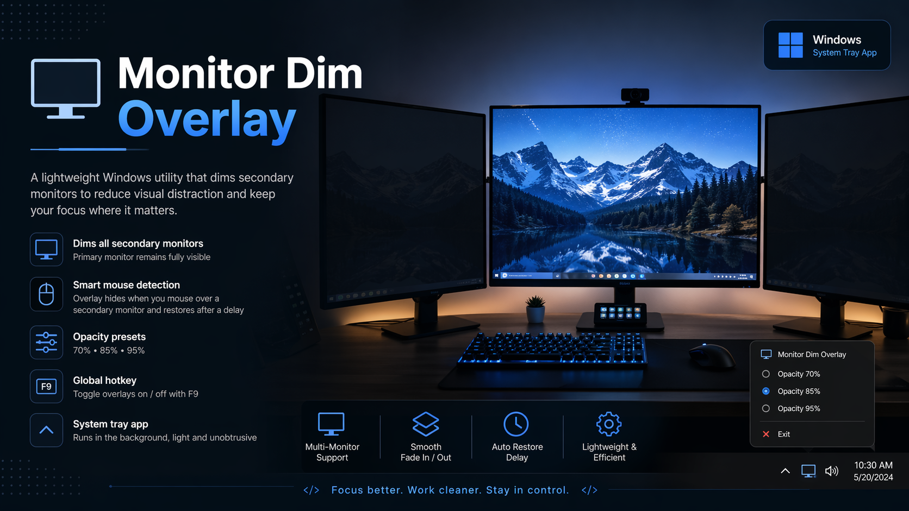

# Monitor Dim Overlay

A lightweight Windows desktop utility that dims secondary monitors with a black overlay, helping reduce visual distraction while keeping the main screen active.

The overlay automatically disappears when the mouse moves onto a dimmed monitor, then fades back in after a short delay.

---

## Overview

**Monitor Dim Overlay** is a small Windows app built with Python and PyQt6.

It creates semi-transparent black overlays on all secondary monitors while leaving the primary monitor untouched. The app runs from the system tray and can be toggled globally with a hotkey.

This tool was made as a simple quality-of-life desktop utility for multi-monitor setups.

---

## Features

- Dims all secondary monitors automatically  
- Keeps the primary monitor fully visible  
- Smooth fade in / fade out animation  
- Automatically hides the overlay when the mouse enters a dimmed monitor  
- Restores the overlay after a short delay  
- Global toggle hotkey: `F9`  
- System tray menu  
- Opacity presets:
  - 70%
  - 85%
  - 95%
- Saves the selected opacity in a local config file  
- Supports monitor changes while the app is running  

---

## How It Works

The app detects all connected screens and identifies the primary monitor.

For every non-primary monitor, it creates a fullscreen black overlay window with adjustable opacity. These overlay windows stay on top, do not take focus, and are ignored by normal window interaction.

Mouse position is checked continuously. When the cursor enters a dimmed monitor, the overlay fades out. When the cursor leaves, the overlay fades back in after a short delay.

---

## Controls

| Action | Control |
|---|---|
| Toggle overlays on/off | `F9` |
| Change opacity | System tray menu |
| Exit app | System tray menu |

---

## System Tray Options

Right-click the tray icon to access:

- `Opacity 70%`
- `Opacity 85%`
- `Opacity 95%`
- `Exit`

The selected opacity is saved automatically.

---

## Configuration

The app creates a local config file next to the executable or script:

`monitor_dim_overlay_config.json`

Example:

{
  "opacity": 0.85
}

If the config file is missing or invalid, the app falls back to the default opacity.

---

## Default Settings

OVERLAY_OPACITY = 0.90  
RESTORE_DELAY_MS = 1000  
POLL_INTERVAL_MS = 100  
FADE_DURATION_MS = 180  
TOGGLE_HOTKEY = "F9"

---

## Requirements

If running from Python:

pip install PyQt6

Required Python modules:

- PyQt6
- ctypes
- json
- pathlib

---

## Running From Source

python monitor_dim_overlay.py

The app will start in the system tray and automatically apply overlays to secondary monitors.

---

## Building as an EXE

Example using PyInstaller:

pyinstaller --noconsole --onefile monitor_dim_overlay.py

The generated executable will be located inside the `dist` folder.

---

## Notes

- This app is intended for Windows.  
- The global hotkey uses the Windows API through ctypes.  
- If another app is already using F9, the hotkey may fail to register.  
- The app only dims secondary monitors, not the primary one.  
- The overlay does not block focus or normal interaction.  

---

## Use Case

This tool is useful when working, gaming, recording, or studying with multiple monitors and wanting to reduce visual noise from unused screens.

It can also help when using a secondary display for references, videos, chats, or tools that do not need constant attention.

---

## Project Purpose

This was created as a small practical Windows utility and portfolio project, focused on:

- Desktop app prototyping  
- PyQt6 UI behavior  
- Multi-monitor handling  
- System tray interaction  
- Windows hotkey integration  
- Lightweight quality-of-life tooling